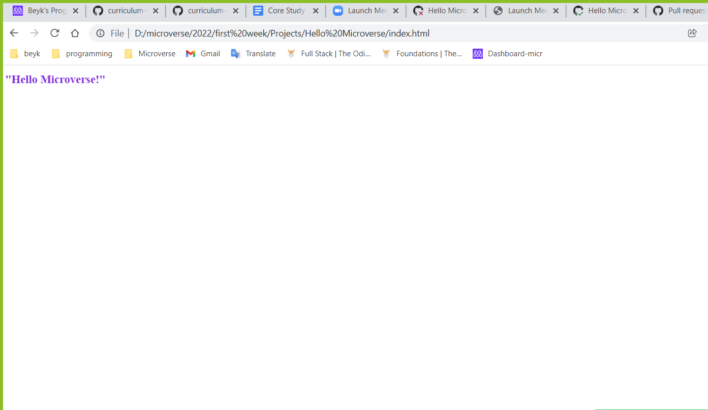

# Hello Microverse

> This is my first exercise in Microverse program.

We learn how to use linters in our project.

## Built With
- Html
- Css
## Getting Started

**This is an simple example of how you may useing .gitignore and linters.**

Feel free to fork it.
## Authors
👤 **Beyk**
- GitHub: [@beyk](https://github.com/beyk)
- Twitter: [@beyk_a](https://twitter.com/beyk_a)
- LinkedIn: [Beyk](https://www.linkedin.com/in/asghar-beykmohammadi-1b16b291/)